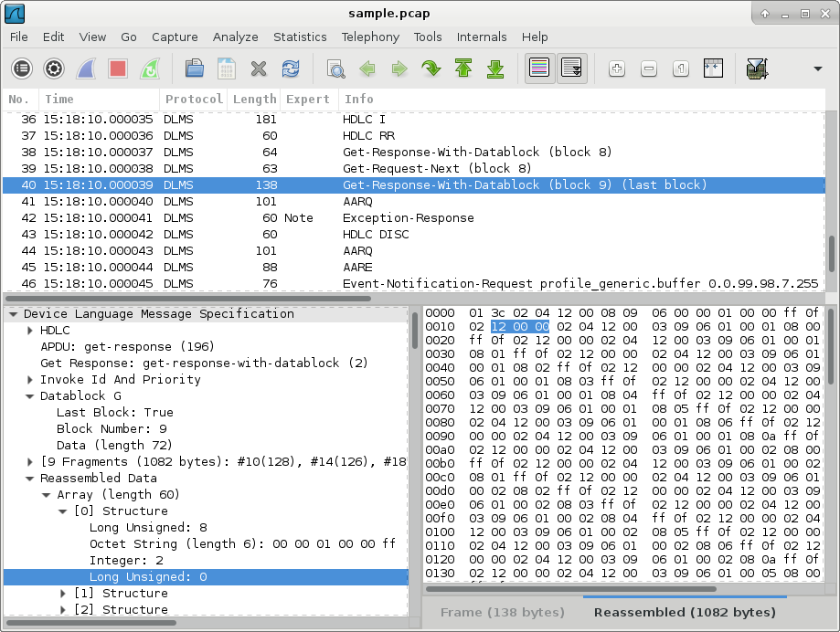

# wireshark-dlms

Device Language Message Specification (DLMS) dissector plugin for Wireshark.
Dissects DLMS APDUs in HDLC frames, IEC 61334-4-32 frames, wrapper frames, or raw data.

Common uses:
- Dissect DLMS protocol in UDP packets with destination port 4059 (the IANA assigned DLMS port), either captured live or imported from a pcap file or hex dump
- Dissect DLMS protocol sent to the external capture program udpdump, listening on any port, with payload type set to DLMS (see https://github.com/andrebdo/wireshark-udpdump for a pre-compiled version of udpdump that works in Windows)
- Dissect DLMS protocol handed off by custom dissectors



## Install

### GNU/Linux

1. Install the Wireshark development libraries: `sudo apt-get install wireshark-dev`
2. Compile the dlms.so plugin: `sh build.sh`
3. Copy the dlms.so plugin to the [Wireshark plugins directory](https://www.wireshark.org/docs/wsug_html_chunked/ChPluginFolders.html):
```
mkdir -p ~/.local/lib/wireshark/plugins && cp dlms.so ~/.local/lib/wireshark/plugins 
# sudo cp dlms.so /usr/lib/x86_64-linux-gnu/wireshark/plugins/2.4.5/dlms.so
```

### Windows

Copy the pre-compiled dlms.dll plugin file to your Wireshark plugins directory (usually C:\Program Files\Wireshark\plugins\2.6\epan\dlms.dll).

To compile the dlms.dll plugin yourself:
1. Compile the Wireshark source code for Windows, as described in https://www.wireshark.org/docs/wsdg_html_chunked/ChSetupWin32.html
2. Edit the build.bat file and adjust the directory paths as necessary
3. Run build.bat

## License

These files are distributed under the same license as Wireshark (the GNU General Public License version 2).
